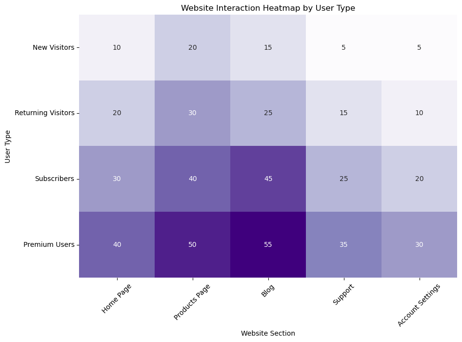

# example-heatmap

My code for the heatmap I shared in my [LinkedIn post](https://www.linkedin.com/posts/kellyjianadams_revised-heatmap-activity-7219065744246898688-6p6K?). 

## Files
- `final_heatmap.py`: fFnal code
- `heatmap.ipynb`: Shows revisions I made based on feedback

## Background
For more background information check out my blog post: [Blog Post Title]()

## Notes
This has been revised from my original heatmap I made, see my blog post [Heat Map Example](https://www.kellyjadams.com/post/heatmap-example-for-linkedin-post-7-12-24) for that. 

## Heatmap

