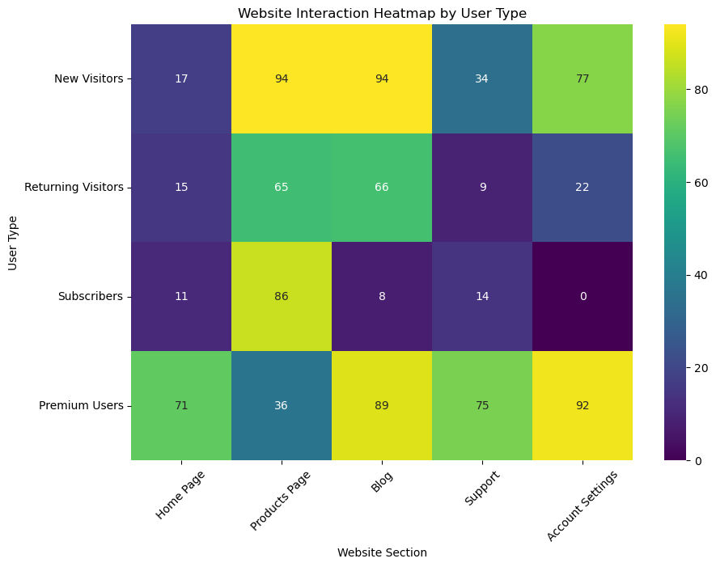

# example-heatmap

My code for the heatmap I shared in my [LinkedIn post](https://www.linkedin.com/posts/kellyjianadams_today-is-the-first-time-ive-created-a-heatmap-activity-7217624942207545344-5AOk). 

For more background information check out my blog post: [Heat Map Example](https://www.kellyjadams.com/post/heatmap-example-for-linkedin-post-7-12-24). 

The heatmap:

